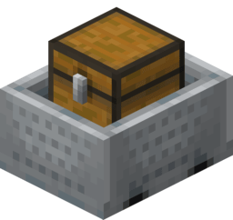

<div align="center">
  <div>
    
    <h1>RandomCart</h1>
    <p>Add a surprise element to mining on your Minecraft server by giving blocks a chance to spawn a "RandomCart" with items in it.</p>
  </div>

  <div>
    
    
  </div>
</div>

### Resource Page
[](https://www.spigotmc.org/resources/randomcart.107038/)
[](https://modrinth.com/plugin/randomcart)

## Compiling
1. #### Clone RandomCart
```sh
git clone https://github.com/StupidCraft/RandomCart.git
```
2. #### Change directory to RandomCart
```sh
cd RandomCart
```
4. #### Build using Gradle
```sh
./gradlew shadowJar
```

You will find a compiled RandomCart Jar file in `build/libs/`.

## License
This project is licensed under the MIT License, you can view the [`LICENSE`](https://github.com/RealTriassic/RandomCart/blob/main/LICENSE) for more information.